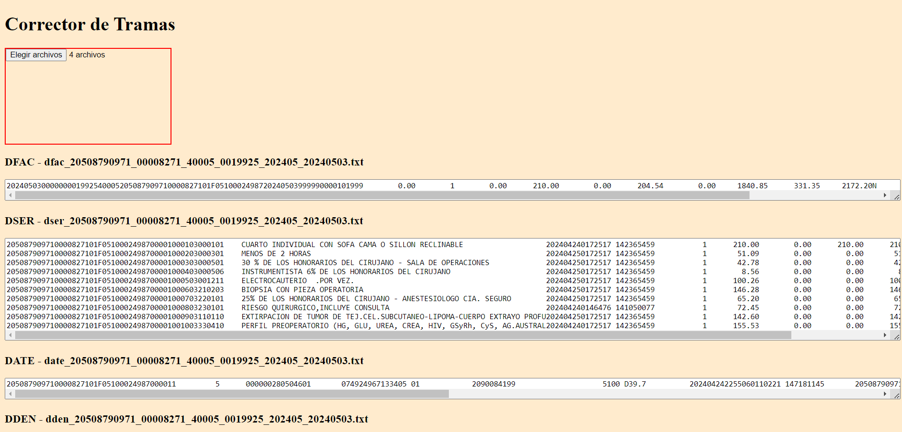

# Corrector Tramas

Ofrece el servicio de correccion de tramas DFAR, DFAC, DATE, DSER a traves de una interfaz web.

**Versión actual:** 0.2.0

## Funcionalidades

- Subida masiva de tramas en archivo de texto
- Funcionalidad de correccion de los tipos de tramas

## Captura de ejecucion

### Licencia

Este proyecto está licenciado bajo la CC BY-NC-ND 4.0 DEED - ver el archivo LICENSE para más detalles.
